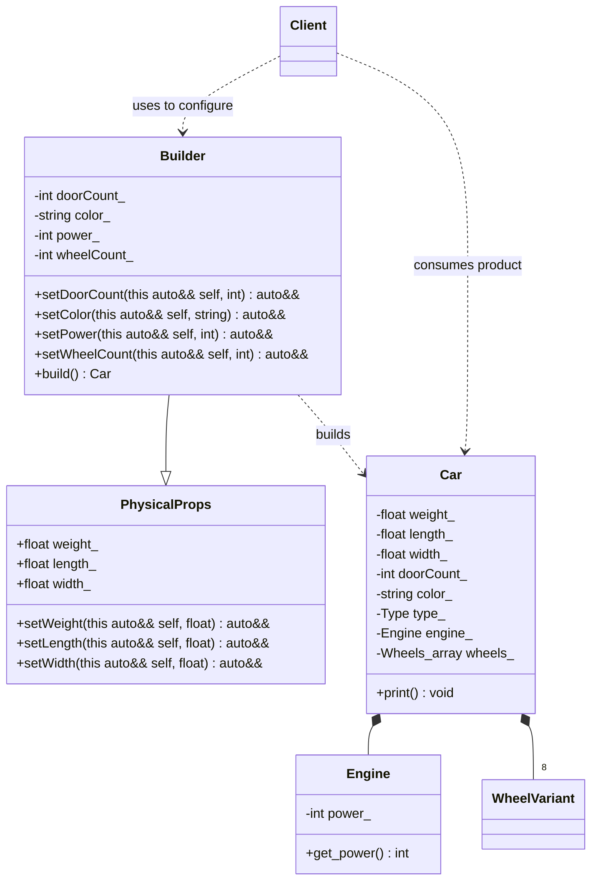

# Builder Pattern (Modern C++23 Deducing This)

### Design Note:
This diagram illustrates the **Modern Hierarchical Builder** enabled by C++23's 
**Deducing This** feature. 

1. **Simplified Hierarchy:** Unlike Example 01 (Flat Builder) or a traditional 
   CRTP implementation, `PhysicalProps` is a standard class (not a template). 
   It can be inherited by any number of specialized Builders.
2. **Explicit Object Parameter:** By using `this auto&& self` in the base class 
   setters, the methods automatically capture and return the derived `Builder` 
   type. This preserves the **Fluent Interface** throughout the entire 
   inheritance chain without "losing" the derived type.
3. **Value Category Awareness:** The use of `auto&&` ensures that the Builder 
   correctly handles both lvalues and temporaries (rvalues), making the 
   chaining robust and efficient.
4. **Stack-Based Architecture:** The design remains faithful to the Zero-Heap 
   philosophy, using `std::variant` and `std::array` for stack-polymorphism 
   within the `Car` product.

**Author:** Mario Galindo Queralt, Ph.D.
