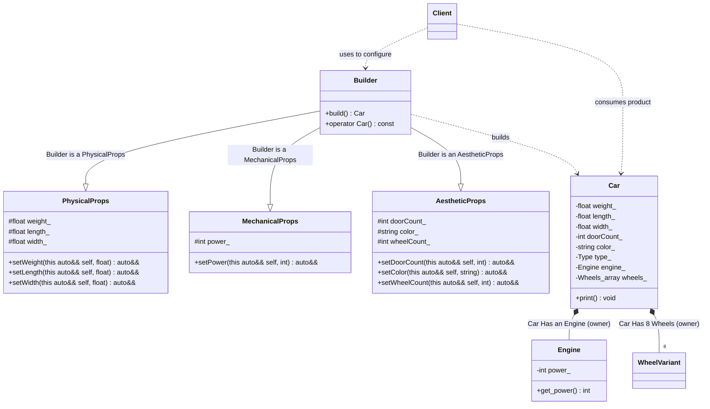

# Builder Pattern (Modern C++23 Deducing This - Multi-Mixin)

### Design Note:
This diagram illustrates the **Advanced Multi-Mixin Builder** enabled by C++23's 
**Deducing This** feature.

1. **Multi-Mixin Composition:** The 'Builder' no longer holds state directly. Instead, 
   it is composed through multiple inheritance from specialized classes: 
   'PhysicalProps', 'MechanicalProps', and 'AestheticProps'. This achieves a 
   clean separation of concerns.
2. **Interface Persistence across Hierarchies:** In traditional C++, splitting 
   setters into multiple base classes would break the fluent chain (a method 
   in 'PhysicalProps' would return a reference to itself, losing access to 
   'MechanicalProps' methods). "Deducing This" ensures that 'self' always refers 
   to the 'Builder', merging all parent APIs into a single, seamless Fluent 
   Interface.
3. **Protected Encapsulation:** By using 'class' with 'protected' data members 
   in the Mixins, we ensure that the internal state is accessible to the 
   'Builder' for the final assembly, but completely hidden from the 'Client', 
   who must use the public API.
4. **Zero-Overhead Static Dispatch:** The entire hierarchy is resolved at 
   compile-time. There are no virtual tables or pointers involved in the 
   builder's structure, adhering to the C++ zero-overhead principle.

**Author:** Mario Galindo Queralt, Ph.D.

---
