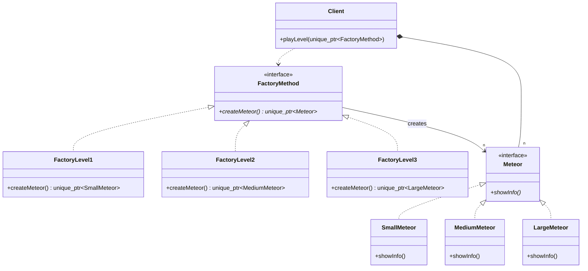

# Factory Method Pattern (GoF)

```mermaid
classDiagram
    class Meteor {
        <<interface>>
        +showInfo()*
    }
    class SmallMeteor {
        +showInfo()
    }
    class MediumMeteor {
        +showInfo()
    }
    class LargeMeteor {
        +showInfo()
    }

    class FactoryMethod {
        <<interface>>
        +createMeteor()* unique_ptr~Meteor~
    }
    class FactoryLevel1 {
        +createMeteor() unique_ptr~SmallMeteor~
    }
    class FactoryLevel2 {
        +createMeteor() unique_ptr~MediumMeteor~
    }
    class FactoryLevel3 {
        +createMeteor() unique_ptr~LargeMeteor~
    }

    class Client {
        +playLevel(unique_ptr~FactoryMethod~)
    }

    Meteor <|.. SmallMeteor
    Meteor <|.. MediumMeteor
    Meteor <|.. LargeMeteor

    FactoryMethod <|.. FactoryLevel1
    FactoryMethod <|.. FactoryLevel2
    FactoryMethod <|.. FactoryLevel3

    %% Abstract creator conceptually creates abstract products
    FactoryMethod --> "n" Meteor : creates

    %% Client uses the abstractions
    Client ..> FactoryMethod
    Client *-- "n" Meteor
```

**Author:** Mario Galindo Queralt, Ph.D.
