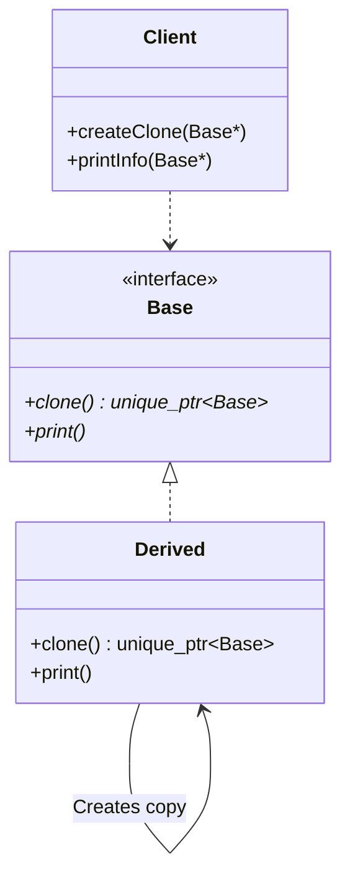

# Prototype Pattern (Virtual Constructor)

```mermaid
classDiagram
    class Base {
        <<interface>>
        +clone()* unique_ptr~Base~
        +print()*
    }
    
    class Derived {
        +clone() unique_ptr~Base~
        +print()
    }

    class Client {
        +createClone(Base*)
        +printInfo(Base*)
    }

    %% Inheritance relationship
    Base <|.. Derived

    %% The clone method creates a new instance of the same concrete type
    Derived --> Derived : Creates copy

    %% Client depends on the abstraction
    Client ..> Base
```

**Author:** Mario Galindo Queralt, Ph.D.
