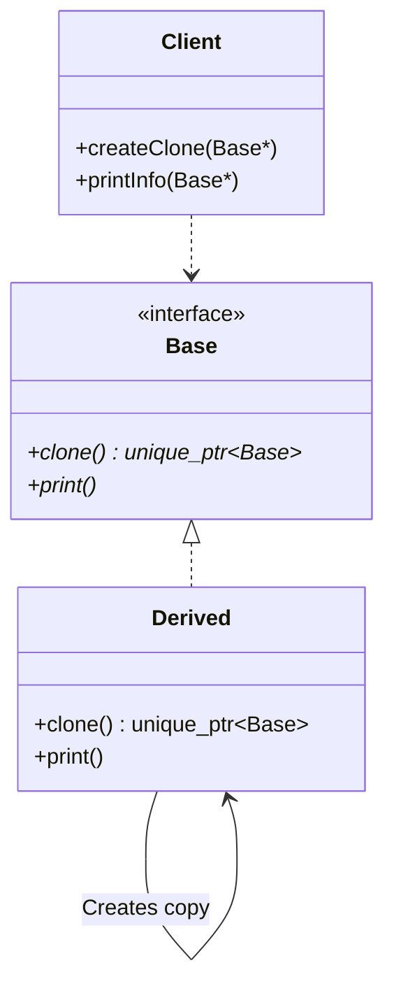

# Prototype Pattern (Virtual Constructor)

### Design Note:
This diagram represents the classic **Virtual Constructor** idiom, the standard
way to implement the Prototype pattern in C++.

1. **Virtual Constructor Idiom:** Since C++ does not support virtual
constructors, the 'clone()' method acts as a surrogate. It allows the 'Client'
to duplicate objects polymorphically through a 'Base' interface without knowing
their concrete types.
2. **Polymorphic Copying:** Each derived class (e.g., 'Derived') is responsible
for implementing its own 'clone()' method, which typically invokes its own copy
constructor (e.g., via 'std::make_unique').
3. **Memory Management:** The use of 'std::unique_ptr<Base>' ensures that the
newly created objects follow RAII principles, preventing memory leaks and
clearly defining resource ownership.
4. **Decoupling:** The 'Client' is entirely decoupled from concrete
implementations. It only interacts with the 'Base' abstraction, making the
system easily extensible by adding new derived classes without modifying
existing client logic.
5. **Trade-off:** The primary disadvantage of this traditional approach is the
**Boilerplate Code**, as every single class in the hierarchy must manually
override the 'clone()' method, which increases maintenance effort.

**Author:** Mario Galindo Queralt, Ph.D.
