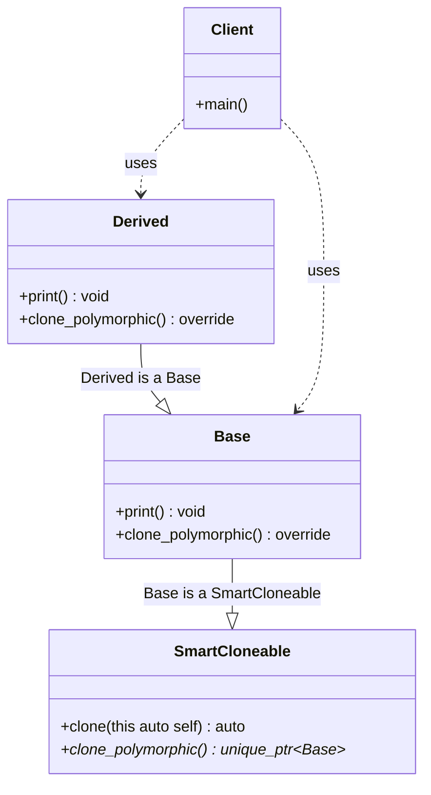

# Prototype Pattern (Modern C++23 Deducing This)

### Design Note:
This diagram illustrates the **Modern Prototype Pattern** using C++23's 
**Deducing This** feature. 

1. **Elimination of Template Bloat:** Unlike the CRTP version (32/03), 
   `SmartCloneable` is a standard, non-template class. It provides the 
   cloning logic once for the entire hierarchy.
2. **Explicit Object Parameter:** The `clone(this auto self)` method uses the 
   deducing this syntax to capture the exact type of the caller. If called 
   from a `Derived` object, `self` is deduced as `Derived`, ensuring a 
   perfect copy without manual overrides.
3. **Pass-by-Value (Copy):** By using `this auto self` (pass-by-value), we 
   leverage the language's built-in copy mechanism. The copy is created 
   automatically as a parameter, and the function simply moves it to the heap.
4. **Hybrid Dispatch:** While the core cloning logic is static and handled 
   by the Mixin, the `clone_polymorphic()` method ensures that objects 
   can still be cloned through a `Base*` pointer, maintaining traditional 
   OO flexibility.

**Author:** Mario Galindo Queralt, Ph.D.

---
