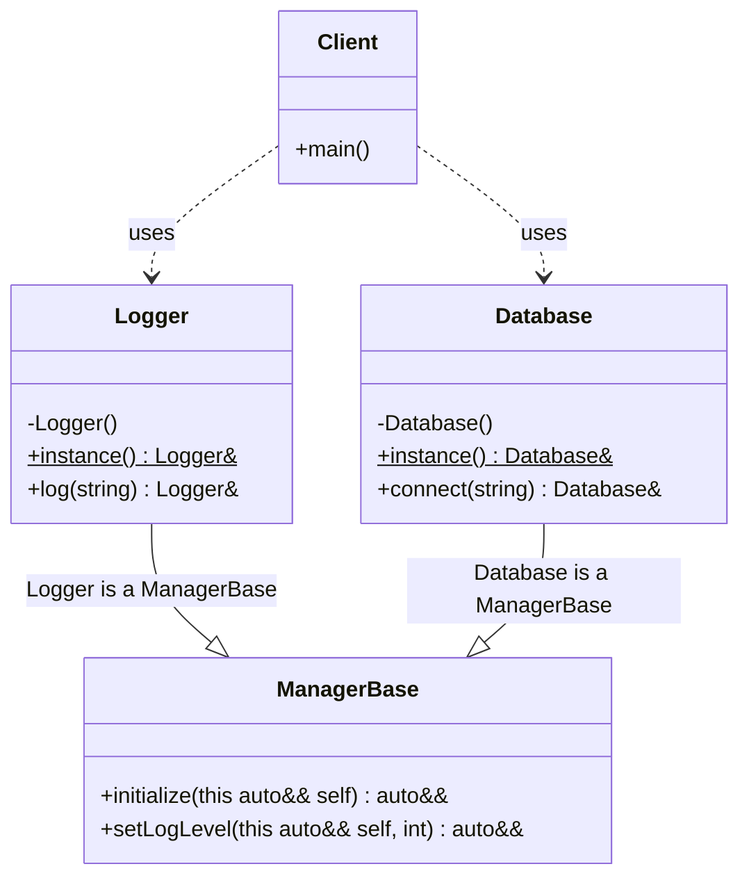

# Singleton Pattern (Modern C++23 Deducing This Hierarchy)

### Design Note:
This diagram illustrates a **Service Hierarchy** implementation using C++23's 
**Deducing This** feature, solving a classic problem in Singleton architecture.

1. **Non-Template Hierarchy:** Traditionally, providing a common interface to 
   multiple Singletons while maintaining a Fluent Interface required the CRTP 
   pattern (e.g., `ManagerBase<Logger>`). With C++23, `ManagerBase` is a 
   standard, non-template class.
2. **Fluent Interface Persistence:** By using `this auto&& self` in the base 
   methods (`initialize`, `setLogLevel`), the return type is automatically 
   deduced as the derived Singleton (`Logger` or `Database`). This allows 
   method chaining to continue with derived-specific methods seamlessly.
3. **Meyer's Singleton Integrity:** Each derived class maintains its own 
   thread-safe, static local instance and enforces the "Rule of Seven" by 
   deleting copy/move operations.
4. **Architectural Decoupling:** General service management logic is centralized 
   in the base class without losing type information in the concrete service 
   implementations.

**Author:** Mario Galindo Queralt, Ph.D.

---
