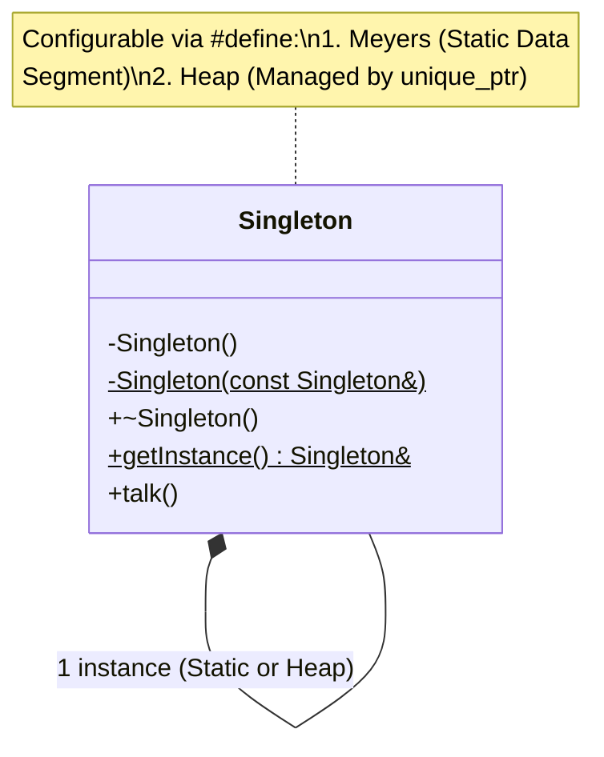

# Singleton Pattern (Simple & Configurable)

### Key Architectural Features:

1. **Configurable Storage**: The implementation allows switching between
**Meyers' Singleton** (stored in the Static Data Segment) and a **Heap-based**
version (managed by `std::unique_ptr`) using a preprocessor `#define`.
2. **Static Access**: The `getInstance()` method provides the unique global
point of access to the instance.
3. **Strict Lifecycle**:
   - The **constructor** is private to prevent external instantiation.
   - **Copy and Assignment** operators are explicitly deleted to prevent duplication.
   - The **destructor** is public to allow the system (Static) or the smart
     pointer (Heap) to clean up the resource.
4. **Memory Safety**: Both implementations guarantee automatic destruction,
avoiding memory leaks regardless of the chosen memory segment.

**Author:** Mario Galindo Queralt, Ph.D.
