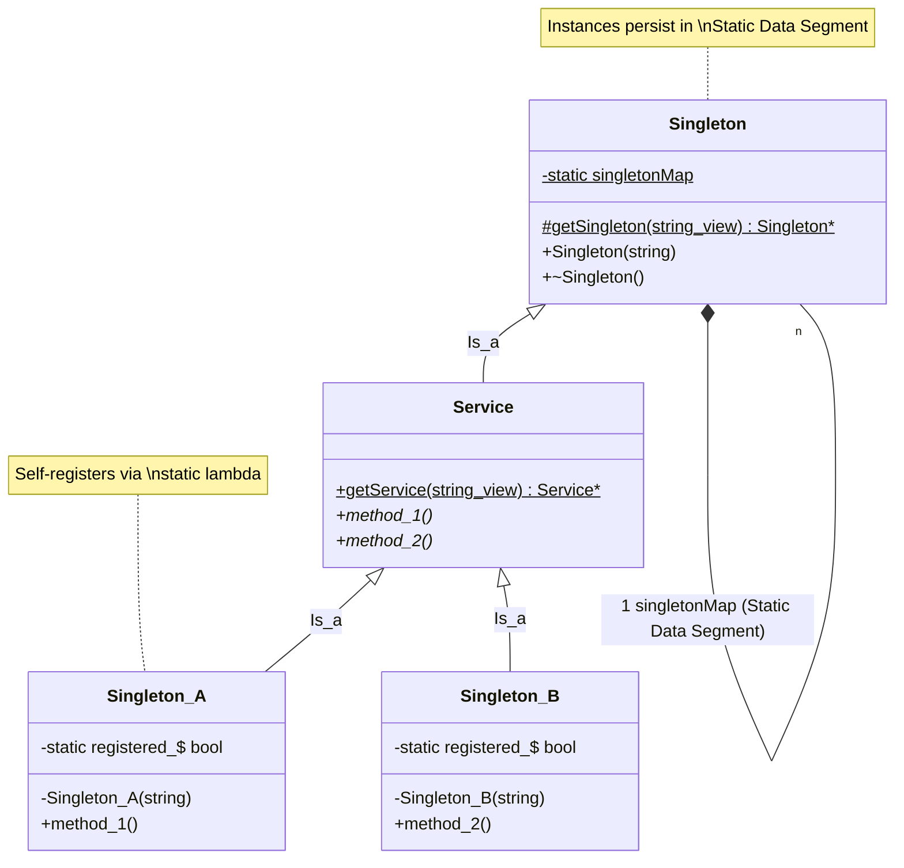

# Singleton Pattern (with Encapsulated Registry)

### Key Architectural Features:
1. **Encapsulated Registration**: Each concrete class (`Singleton_A`,
`Singleton_B`) owns its registration logic through the private `static bool
registered_` member.
2. **Visibility Control**: Constructors of concrete classes are `private`,
ensuring that instances can only be created by the internal auto-registration
mechanism.
3. **Static Storage**: All registered instances live in the **Static Data
Segment**, providing high performance and avoiding heap fragmentation.
4. **Type-Safe Access**: The `Service` class provides a specialized access point
(`getService`) that returns the correct interface type without the client
needing to perform manual casting.

**Author:** Mario Galindo Queralt, Ph.D.
