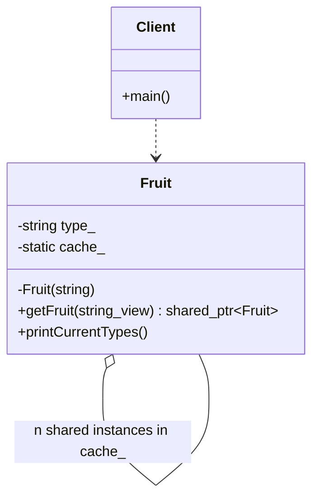

# Lazy Initialization Pattern

### Design Note:
This diagram represents the **Factory-Level Lazy Initialization** pattern, often
used in conjunction with a Flyweight cache.

1. **On-Demand Creation:** The 'Fruit' objects are not pre-allocated. The static
factory method 'getFruit' acts as the gatekeeper, ensuring that an instance is
only constructed when a client explicitly requests it for the first time.
2. **Internal Cache (Multiton):** The private static 'cache_' (std::map) stores
existing instances. This turns the pattern into a "Multiton", where a single
unique instance exists for each specific key (e.g., "Banana", "Apple"), ensuring
resource reuse.
3. **Shared Ownership:** The use of 'std::shared_ptr' allows the factory to
maintain a reference in the cache while safely sharing ownership with multiple
clients. The object's lifecycle is automatically managed by RAII, being
destroyed only when both the cache and all clients release it.
4. **Encapsulation:** The constructor is private to strictly enforce the use of
the factory method, preventing clients from bypassing the lazy-loading and
caching logic.

**Author:** Mario Galindo Queralt, Ph.D.
