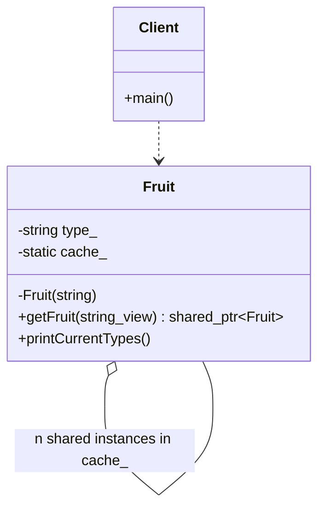

# Lazy Initialization Pattern

```mermaid
classDiagram
   class Fruit {
      -string type_
      -static cache_
      -Fruit(string)
      +getFruit(string_view) shared_ptr~Fruit~
      +printCurrentTypes()
   }

   class Client {
      +main()
   }

   %% The class manages its own instances lazily in a cache
   %% We use the label to avoid the multiplicity bug on recursive arrows
   Fruit o-- Fruit : n shared instances in cache_

   %% Client depends on the Fruit factory
   Client ..> Fruit
```

**Author:** Mario Galindo Queralt, Ph.D.
