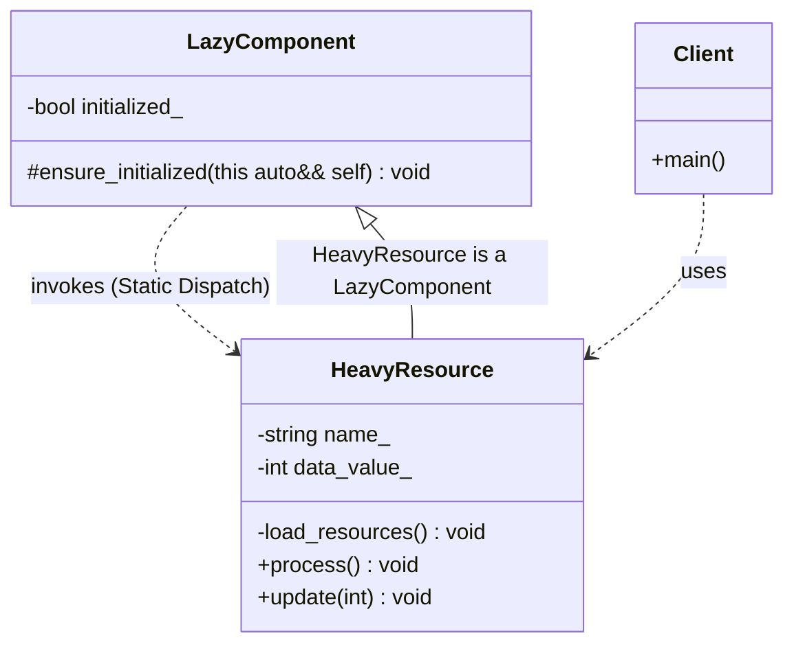

# Lazy Initialization (Modern C++23 Deducing This)

### Design Note:
This diagram illustrates a **Transparent Object-level Lazy Initialization** 
pattern, optimized with C++23's **Deducing This** feature.

1. **Zero-Overhead Infrastructure:** The 'LazyComponent' acts as a reusable 
   infrastructure Mixin. Unlike traditional designs, it does not use virtual 
   functions (avoiding VTable costs) or CRTP (avoiding template complexity). 
   The 'ensure_initialized' method resolves the derived type at compile-time.
2. **Static Dispatch Injection:** By using the explicit object parameter 
   (this auto&& self), the base class can "reach into" the derived 
   'HeavyResource' to trigger the private 'load_resources()' method. 
   This achieves polymorphic behavior with the performance of static code.
3. **API Transparency:** The 'Client' is completely unaware of the lazy loading 
   mechanism. It calls 'process()' or 'update()' as it would with any standard 
   object. The "Lazy Check" is a safety layer handled internally by the object 
   itself.
4. **Encapsulation:** The heavy loading logic remains private within the 
   business class, while the initialization state is managed by the 
   infrastructure Mixin, ensuring a clean separation of concerns.

**Author:** Mario Galindo Queralt, Ph.D.

---
