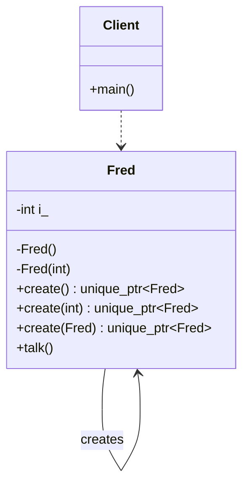

# Named Constructors (Force Heap Allocation)

```mermaid
classDiagram
   class Fred {
      -int i_
      -Fred()
      -Fred(int)
      +create() unique_ptr~Fred~
      +create(int) unique_ptr~Fred~
      +create(Fred) unique_ptr~Fred~
      +talk()
   }

   class Client {
      +main()
   }

   %% Dependency: No numbers used here
   Fred --> Fred : creates
   Client ..> Fred
```

**Author:** Mario Galindo Queralt, Ph.D.
