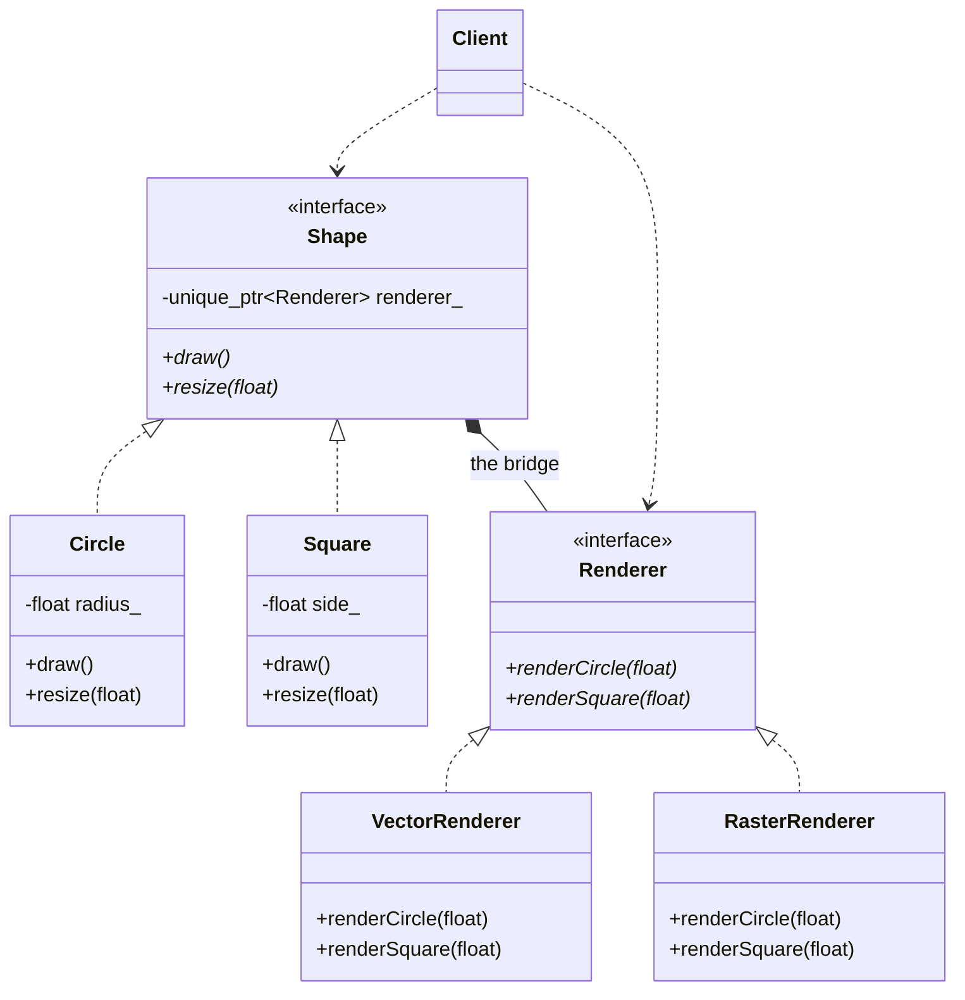

# BRIDGE PATTERN (STRUCTURAL)
**Author:** Mario Galindo Queralt, Ph.D.

## Intent
The Bridge pattern is designed to decouple an abstraction from its 
implementation so that the two can vary independently. It separates the 
"logic" hierarchy from the "platform" hierarchy.

## The Problem
Imagine you have a class 'Shape' with subclasses 'Circle' and 'Square'. 
## Now you want to support two rendering platforms 'Vector' and 'Raster'.
Without Bridge, you would need 4 classes: 
(VectorCircle, RasterCircle, VectorSquare, RasterSquare).
If you add a 'Triangle', you need 2 more. If you add '3D' rendering, you 
need another 3. This leads to an exponential "Cartesian Product" explosion 
of classes.

## The Solution
Instead of using inheritance in a single hierarchy, we split the code into 
two independent dimensions:
1. Abstraction: The high-level logic (What it IS - e.g., a Circle).
2. Implementer: The platform-specific logic (How it DRAWS - e.g., OpenGL).

The Abstraction contains a reference (the "Bridge") to an Implementer object.

## Our Example
Scenario:
- Abstraction: 'Shape' (Circle, Square). It knows about its size or radius.
- Implementer: 'Renderer' (VectorRenderer, RasterRenderer). It knows how 
to draw lines or pixels on a screen.

By connecting them through a Bridge, a 'Circle' can work with ANY 'Renderer' 
without needing a specific class for every combination.

## Key Benefits
- Independence: You can develop new shapes without touching the renderers, 
and vice versa.
- Runtime Switching: You can change the implementation (e.g., switch from 
OpenGL to DirectX) at runtime by simply swapping the implementer object.
- Hiding Complexity: The client only interacts with the Abstraction; 
implementation details are completely hidden.

---
# Bridge Pattern (GoF)

**Author:** Mario Galindo Queralt, Ph.D.
