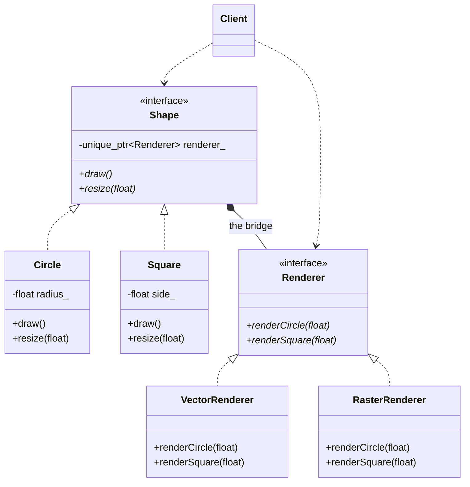

# Bridge Pattern (GoF)

```mermaid
classDiagram
   class Renderer {
      <<interface>>
      +renderCircle(float)*
      +renderSquare(float)*
   }

   class VectorRenderer {
      +renderCircle(float)
      +renderSquare(float)
   }

   class RasterRenderer {
      +renderCircle(float)
      +renderSquare(float)
   }

   class Shape {
      <<interface>>
      -unique_ptr~Renderer~ renderer_
      +draw()*
      +resize(float)*
   }

   class Circle {
      -float radius_
      +draw()
      +resize(float)
   }

   class Square {
      -float side_
      +draw()
      +resize(float)
   }

   %% Implementer hierarchy
   Renderer <|.. VectorRenderer
   Renderer <|.. RasterRenderer

   %% Abstraction hierarchy
   Shape <|.. Circle
   Shape <|.. Square

   %% The Bridge: Shape owns a Renderer
   Shape *-- Renderer : the bridge

   %% Client depends on abstractions but instantiates concrete types
   Client ..> Shape
   Client ..> Renderer
```

**Author:** Mario Galindo Queralt, Ph.D.
