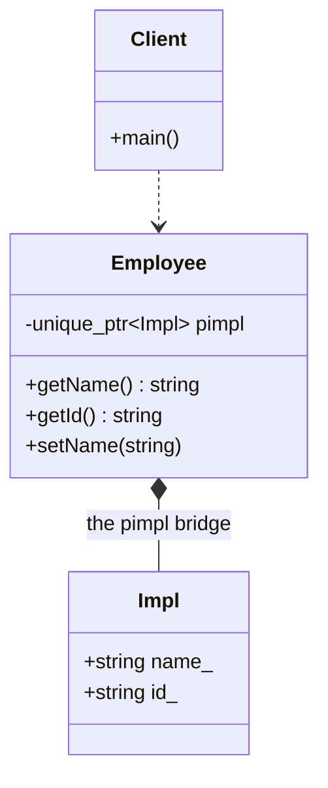

# Bridge Pattern: Pimpl Idiom

```mermaid
classDiagram
   class Employee {
      -unique_ptr~Impl~ pimpl
      +getName() string
      +getId() string
      +setName(string)
   }

   class Impl {
      +string name_
      +string id_
   }

   class Client {
      +main()
   }

   %% The Bridge (Pimpl): Employee owns the implementation object
   Employee *-- Impl : the pimpl bridge

   %% Client only knows about the Employee interface
   Client ..> Employee
```

**Author:** Mario Galindo Queralt, Ph.D.
