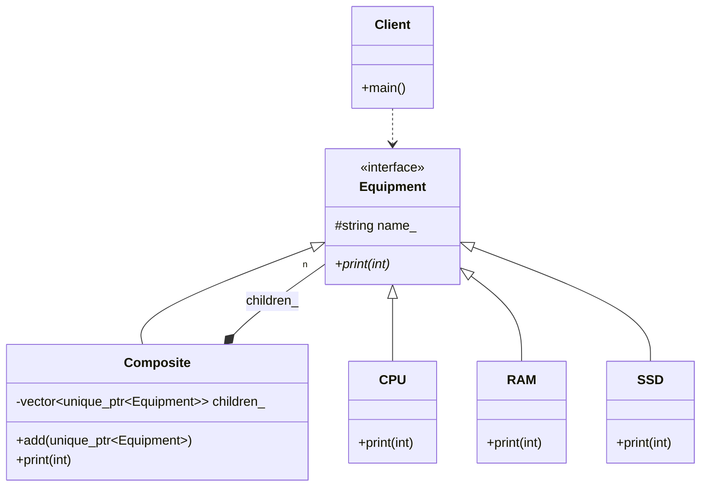

# Composite Pattern

```mermaid
classDiagram
   class Equipment {
      <<interface>>
      #string name_
      +print(int)*
   }

   class CPU {
      +print(int)
   }

   class RAM {
      +print(int)
   }

   class SSD {
      +print(int)
   }

   class Composite {
      -vector~unique_ptr~Equipment~~ children_
      +add(unique_ptr~Equipment~)
      +print(int)
   }

   class Client {
      +main()
   }

   %% Inheritance (Is_a) - No numbers
   Equipment <|-- Composite
   Equipment <|-- CPU
   Equipment <|-- RAM
   Equipment <|-- SSD

   %% Composition (Has_a) - Multiplicity "n" at the end
   Composite *-- "n" Equipment : children_

   %% Dependency - No numbers
   Client ..> Equipment
```

**Author:** Mario Galindo Queralt, Ph.D.
