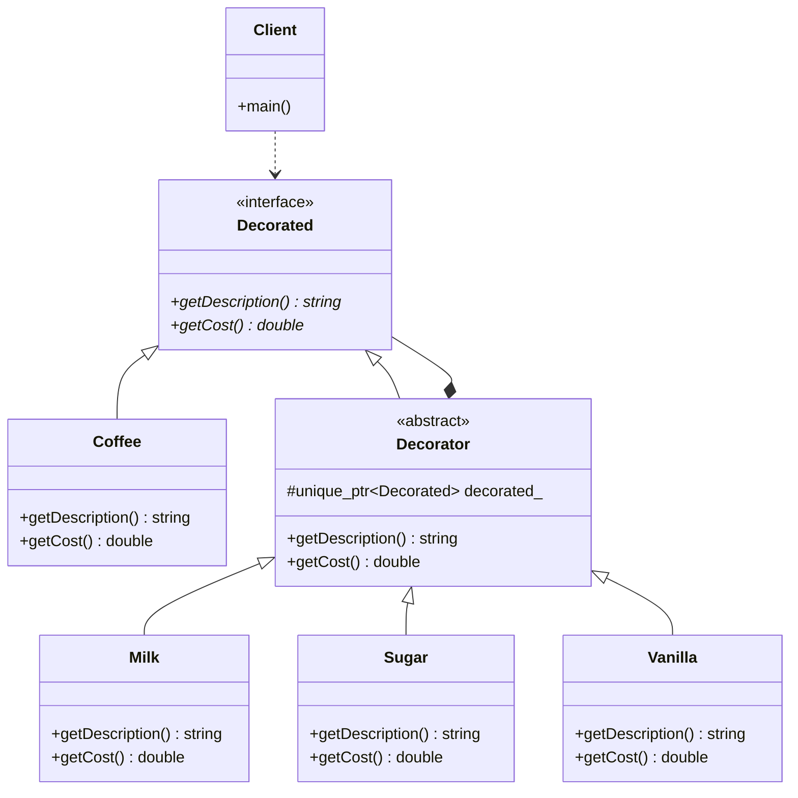

# Decorator Pattern (Simple)

```mermaid
classDiagram
   class Decorated {
      <<interface>>
      +getDescription()* string
      +getCost()* double
   }

   class Coffee {
      +getDescription() string
      +getCost() double
   }

   class Decorator {
      <<abstract>>
      #unique_ptr~Decorated~ decorated_
      +getDescription() string
      +getCost() double
   }

   class Milk {
      +getDescription() string
      +getCost() double
   }

   class Sugar {
      +getDescription() string
      +getCost() double
   }

   class Vanilla {
      +getDescription() string
      +getCost() double
   }

   class Client {
      +main()
   }

   %% Inheritance (Is_a)
   Decorated <|-- Coffee
   Decorated <|-- Decorator
   Decorator <|-- Milk
   Decorator <|-- Sugar
   Decorator <|-- Vanilla

   %% Composition (Has_a)
   Decorator *-- Decorated

   %% Dependency - No numbers
   Client ..> Decorated
```

**Author:** Mario Galindo Queralt, Ph.D.
