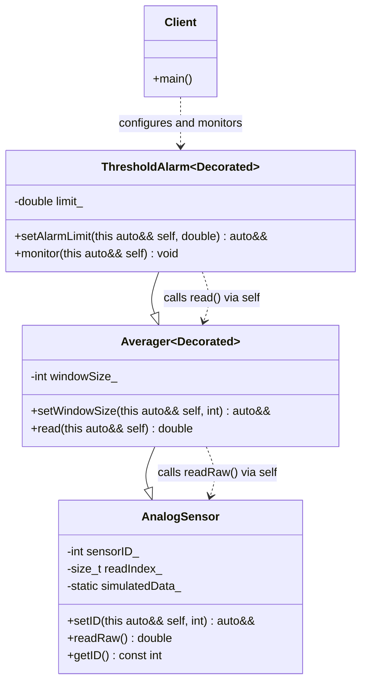

# Static Decorator Pattern (Modern C++23 Deducing This)

### Design Note:
This diagram illustrates the **Modern Static Decorator** (Mixin Inheritance) 
implemented with C++23 **"Deducing This"**, modeling an Industrial Sensor system.

1. **Interface Persistence:** Unlike traditional static decorators where calling 
   a base method (like 'setID') returns a reference to the base, C++23 allows 
   the base class to return the "most derived" type ('self'). This ensures 
   the chain is never broken, preserving the full API of the outermost 
   decorator throughout the entire configuration process.
2. **Identity Preservation:** The composite object is treated as a single, 
   atomic entity in memory. Modifying a property in the hardware layer 
   ('setID') does not "strip away" the intelligence added by the decorators 
   ('Averager' or 'ThresholdAlarm').
3. **Runtime Calibration vs. Static Structure:** The architectural structure 
   (the pipeline of filters and alarms) is fixed at compile-time for maximum 
   performance (zero VTable overhead). However, functional parameters like 
   'windowSize' and 'alarmLimit' remain adjustable at runtime, providing 
   necessary industrial flexibility.
4. **Total Hierarchy Visibility:** Because 'self' always represents the 
   complete object, any layer can invoke methods from any other layer 
   regardless of the nesting order. This transforms the "Onion-Layer" 
   inheritance into a "Transparent Composite" structure.
5. **Zero-Overhead Principle:** By resolving the composition at compile-time, 
   the compiler can inline the entire processing chain, resulting in 
   the same performance as a manually optimized monolithic class.

**Author:** Mario Galindo Queralt, Ph.D.
