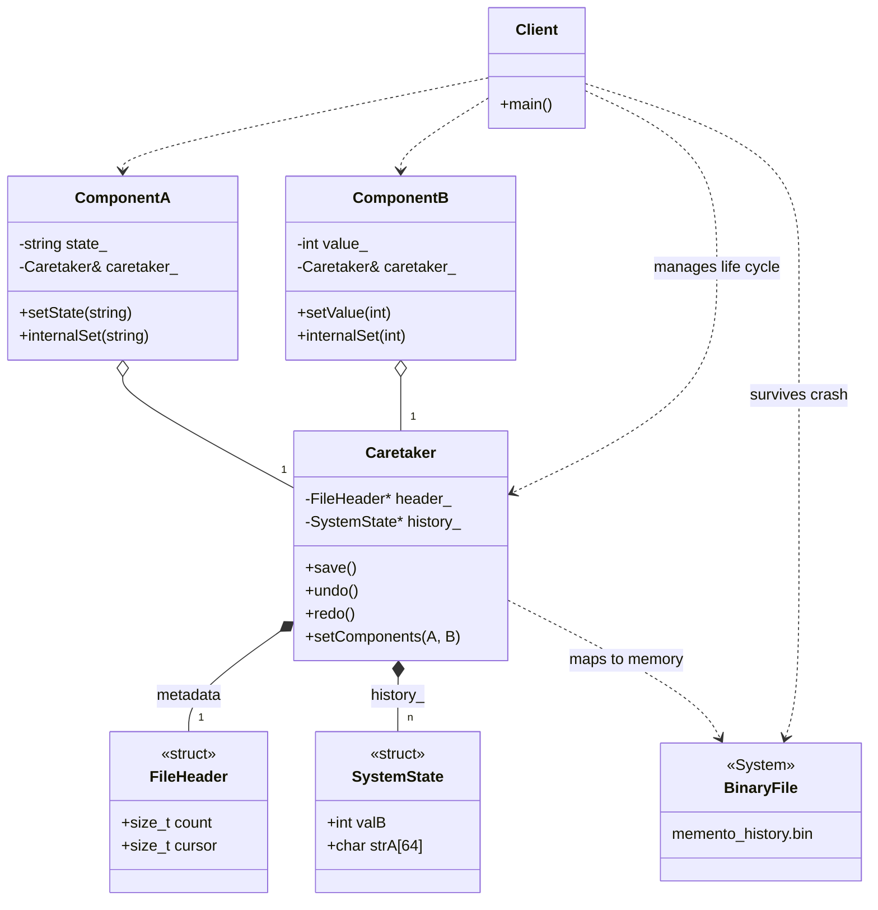

# MEMENTO PATTERN: PERSISTENT BINARY SNAPSHOTS (MMAP)

## Intent
To implement a high-performance Memento pattern that is synchronized with 
the disk in real-time. This version provides a robust Undo/Redo system 
capable of recovering the full application state after an unexpected crash.

## The Evolution: From Strings to Binary Persistence
While the previous examples focused on object hierarchies or text 
serialization, this implementation targets systems where performance and 
crash-resilience are critical:

1. Memory-Mapped Files (mmap):
   Instead of manual file writing (ofstream), we map a binary file directly 
   into the process's address space. The Operating System handles the 
   synchronization between RAM and Disk, ensuring that the history is 
   persisted almost instantly.

2. System-Wide Snapshots:
   Each entry in the history is a "SystemState" structure (POD) that captures 
   the values of all components (A and B) simultaneously. This simplifies the 
   Client logic, as it no longer needs to track which object to restore.

3. Crash Recovery:
   The Caretaker is designed to detect an existing history file upon 
   initialization. If a previous session exists, it automatically restores 
   the system to the last saved state, effectively simulating a "Restart 
   after Crash" scenario.

## Our Example: The CD Player History
We use the same components (A and B) but with an advanced Caretaker:
- Auto-Save: Components are wired to the Caretaker to trigger a 
  checkpoint on every 'setState' or 'setValue' call.
- Undo/Redo: A cursor-based timeline allows moving back and forth 
  through 100 historical states without destroying data.
- Timeline Bifurcation: Following industry standards, performing a new 
  action after an Undo will overwrite the "future" history, creating 
  a new branch and discarding previous Redos.

## Technical Requirements
This example uses POSIX-specific headers (sys/mman.h) and is 
intended for Linux/Unix environments. 

```cpp
// The core logic of the time-travel cursor:
void save() 
{
   if (isRestoring_) return;
   header->cursor++;
   history[header->cursor] = currentState;
   header->count = header->cursor + 1; // Discards future Redos
}
```

---
# Memento Pattern (Persistent Mmap Version)



### Design Note:
This version implements a **High-Performance Persistent Memento**. 
The `Caretaker` maps a `BinaryFile` directly into memory using `mmap`. 
1. **Auto-Save**: `ComponentA` and `ComponentB` hold a reference to the 
   `Caretaker` and trigger a `save()` automatically on every mutation. 
2. **Binary Snapshots**: Each state is a POD `SystemState` struct containing 
   the full system data, ensuring atomic restores. 
3. **Crash Resilience**: Because the `FileHeader` (with the cursor) and the 
   `history_` are stored on disk, the system can perfectly recover its latest 
   state after a program crash, allowing for continued Undo/Redo operations.
