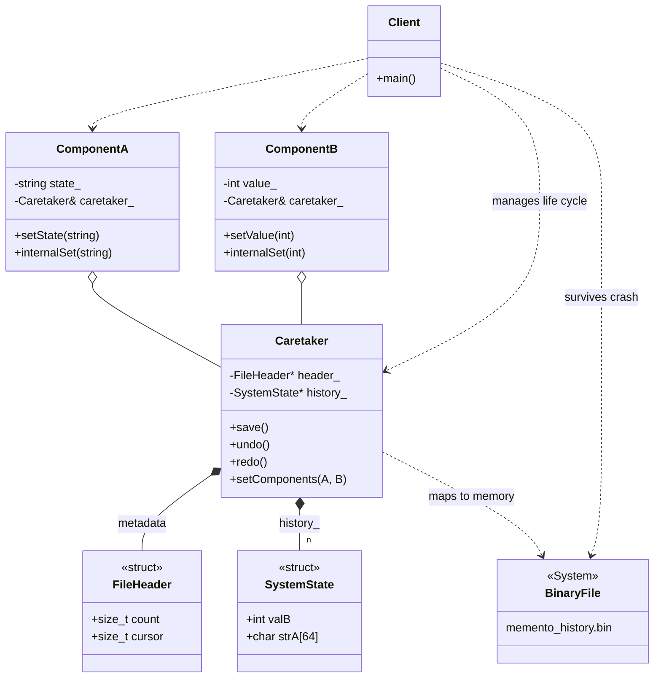

# Memento Pattern (Persistent Mmap Version)

### Design Note:
This version implements a **High-Performance Persistent Memento**. 
The `Caretaker` maps a `BinaryFile` directly into memory using `mmap`. 
1. **Auto-Save**: `ComponentA` and `ComponentB` hold a reference to the 
   `Caretaker` and trigger a `save()` automatically on every mutation. 
2. **Binary Snapshots**: Each state is a POD `SystemState` struct containing 
   the full system data, ensuring atomic restores. 
3. **Crash Resilience**: Because the `FileHeader` (with the cursor) and the 
   `history_` are stored on disk, the system can perfectly recover its latest 
   state after a program crash, allowing for continued Undo/Redo operations.

**Author:** Mario Galindo Queralt, Ph.D.
