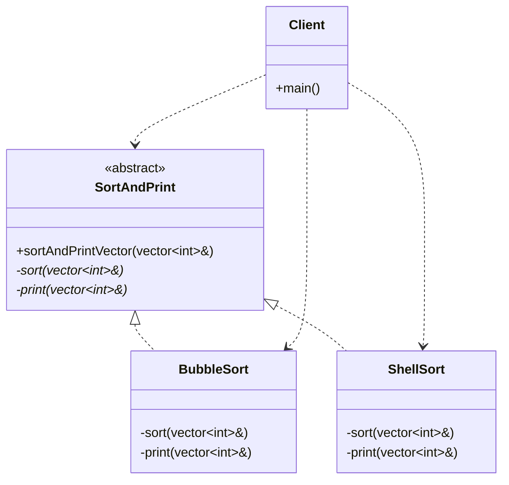

# TEMPLATE METHOD PATTERN (BEHAVIORAL)
**Author:** Mario Galindo Queralt, Ph.D.

## Intent
The Template Method pattern defines the skeleton of an algorithm in a base 
class, deferring some steps to subclasses. It lets subclasses redefine 
certain steps of an algorithm without changing the algorithm’s structure. 
In C++, this pattern is frequently implemented using the **Non-Virtual 
Interface (NVI)** idiom.

## The Problem
When you have an algorithm with a fixed sequence of steps, but some of those 
steps need to be implemented in different ways depending on the context, 
using rigid structures creates duplicated code. If the outline of the 
algorithm changes, you have to update every single subclass. Additionally, 
making virtual functions public can lead to the "Fragile Base Class" problem, 
where subclasses might accidentally interfere with the mandatory execution 
flow.

## The Solution
Define a "template method" in a base class that outlines the algorithm steps 
(e.g., sort, then print). The base class provides the invariant parts 
(the skeleton), while subclasses implement the variant parts (the specific 
steps). This follows the Hollywood Principle: "Don't call us, we will call you".

## The Non-Virtual Interface (NVI) Idiom
In modern C++, the Template Method is the foundation for the NVI idiom. This 
approach separates the stable public interface from overridable 
implementation details:

1. **Public Interface:** Public functions are **non-virtual**. They define 
   "what" the class does and act as a stable "wrapper" or "skeleton".
2. **Private Implementation:** Virtual functions are **private** (or 
   protected). They define "how" specific steps are performed. Subclasses 
   override these to provide custom behavior.

### Why use NVI?
- **Enforce Invariants:** The base class can execute mandatory code before 
  and after the virtual call (e.g., locking a mutex, validating parameters, 
  logging execution).
- **Fragile Base Class Protection:** By making virtual functions private, 
  you reduce the risk of derived classes calling internal logic 
  inconsistently.
- **Stability:** You can change the base class's internal logic (the 
  wrapper) without breaking the public API.

### Guidelines for NVI:
- **Prefer non-virtual interfaces:** Public APIs should be non-virtual 
  template methods.
- **Virtuals should be private:** Unless a derived class must call the base 
  version, in which case they should be protected.
- **Destructor Exception:** A base class destructor should be public and 
  virtual OR protected and non-virtual.

## Key Participants
- **Abstract Class (SortAndPrint):** Defines the template method (the skeleton) 
  and declares abstract placeholder methods for the steps.
- **Concrete Classes (BubbleSort, ShellSort):** Implement the placeholder 
  methods to provide specific behavior.

## Strategy vs. Template Method
- **Strategy Pattern:** Uses COMPOSITION. You pass a strategy object to the 
  context. Behavior can change at runtime.
- **Template Method Pattern:** Uses INHERITANCE. Behavior is defined by 
  overriding methods in subclasses. Behavior is fixed at compile-time.

## Key Benefits
- **Code Reuse:** Invariant parts are written once in the base class.
- **Flexibility:** Subclasses customize steps without altering the structure.
- **Open/Closed Principle:** Add new algorithms without modifying base code.

---
# Template Method Pattern

### Design Note:
This diagram illustrates the Template Method pattern implemented via the 
**Non-Virtual Interface (NVI)** idiom. 

1. **Skeleton & Invariants:** The public 'sortAndPrintVector' method defines the 
   algorithm's skeleton. It centralizes **invariant code** (administrative tasks 
   like timing, logging, or validation) that must execute regardless of the 
   subclass used.
2. **Variant Parts (The "How"):** The specific sorting and printing steps are 
   defined as **private virtual** placeholders. This prevents subclasses from 
   calling these steps independently, ensuring the base class maintains 
   total control over the execution flow (Hollywood Principle).
3. **Encapsulation:** By separating the stable interface (public) from the 
   volatile implementation (private virtuals), the class becomes more robust 
   against changes, following the modern C++ philosophy of protecting the 
   Fragile Base Class.

**Author:** Mario Galindo Queralt, Ph.D.
