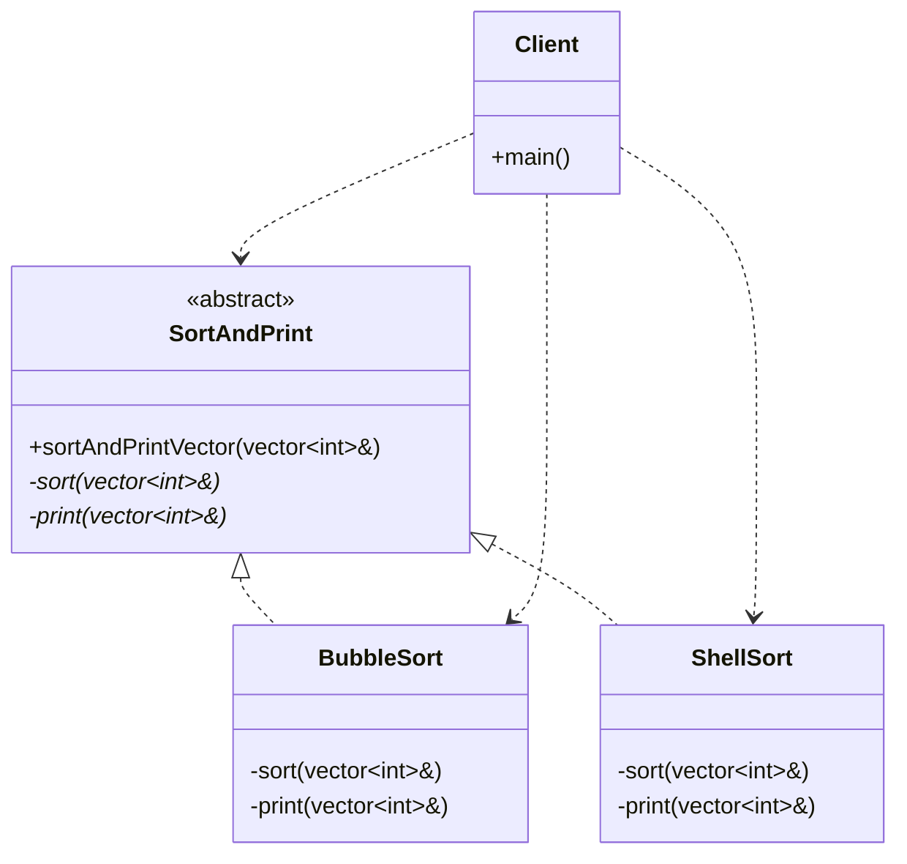

# Template Method Pattern

### Design Note:
This diagram illustrates the Template Method pattern implemented via the 
**Non-Virtual Interface (NVI)** idiom. 

1. **Skeleton & Invariants:** The public 'sortAndPrintVector' method defines the 
   algorithm's skeleton. It centralizes **invariant code** (administrative tasks 
   like timing, logging, or validation) that must execute regardless of the 
   subclass used.
2. **Variant Parts (The "How"):** The specific sorting and printing steps are 
   defined as **private virtual** placeholders. This prevents subclasses from 
   calling these steps independently, ensuring the base class maintains 
   total control over the execution flow (Hollywood Principle).
3. **Encapsulation:** By separating the stable interface (public) from the 
   volatile implementation (private virtuals), the class becomes more robust 
   against changes, following the modern C++ philosophy of protecting the 
   Fragile Base Class.

**Author:** Mario Galindo Queralt, Ph.D.
