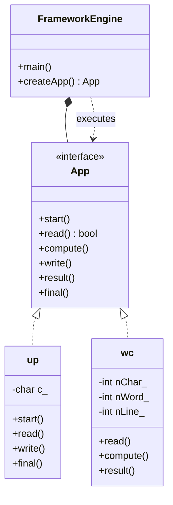

# FRAMEWORK DESIGN PATTERN
**Author:** Mario Galindo Queralt, Ph.D.

A framework design pattern refers to the architectural strategies and 
reusable solutions used to build, structure, and maintain software 
frameworks, which are sets of cooperating classes that provide a skeleton 
for an application. Unlike design patterns (which are abstract, low-level, 
and language-independent), frameworks are concrete code that defines an 
application's architecture and follows the "Hollywood Principle" 
("Don't call us, we call you").

## Key Characteristics and Components

- **Hollywood Principle:** The framework controls the flow, calling 
user-implemented code to perform specific tasks.

- **Inversion of Control (IoC):** Frameworks manage the flow and lifecycle 
of objects, unlike libraries where the user controls the flow.

- **Extensibility:** Frameworks are designed to be extended by users 
(e.g., via inheritance or implementing specific methods).

- **Containment:** A single framework often contains multiple, cooperating 
design patterns. 

## Common Design Patterns Used in Frameworks

- **Template Method:** Defines the skeleton of an algorithm, leaving 
specific steps to be implemented by the user.
- **Factory Method/Abstract Factory:** Used for creating objects without 
specifying their exact, concrete class.
- **Strategy:** Enables the selection of an algorithm or behavior at runtime.
- **Observer:** Frequently used in reactive systems for event handling.
- **Facade:** Provides a simplified, high-level interface to a complex 
underlying subsystem.
- **Dependency Injection (DI):** Used to manage object lifecycles and 
dependencies externally.
- **Page Object Model (POM):** A specific pattern for UI/automation frameworks. 

## Our Example The 'App' Framework

We have built a concrete framework (libFramework.so) that provides the 
execution skeleton for console-based applications. It handles the lifecycle 
of the application, leaving the specific logic to the user:

1. **Framework/:**
Contains the 'App' base class and the framework's 'main' entry point. 
It implements the "Hollywood Principle" by calling the user's methods 
(start, read, compute, write, result, final).

2. **up/:**
A client application that uses our framework to convert text files to 
UPPERCASE. It implements only the specific logic required by the 
framework skeleton.

3. **wc/:**
A client application that uses our framework to count lines, words, 
and characters in a file. It demonstrates how different tools can 
share the same architectural skeleton.

## Benefits of Using Framework Design Patterns

- **Code Reusability:** Established structures prevent rewriting standard code.
- **Maintainability and Scalability:** Separating concerns makes systems 
easier to modify.
- **Consistency:** Standardized methods ensure high-quality code across 
projects.

---
# Framework Design Pattern

### Design Note:
This diagram illustrates the "Hollywood Principle" (Inversion of Control). The
'FrameworkEngine' (representing 'libFramework.so') owns the main execution
loop. It is responsible for creating exactly one instance of an 'App' and
calling its methods in the predefined sequence. Concrete applications like 'up'
and 'wc' simply plug into this skeleton by inheriting from 'App', providing
their specific logic without ever controlling the main loop themselves.

**Author:** Mario Galindo Queralt, Ph.D.
