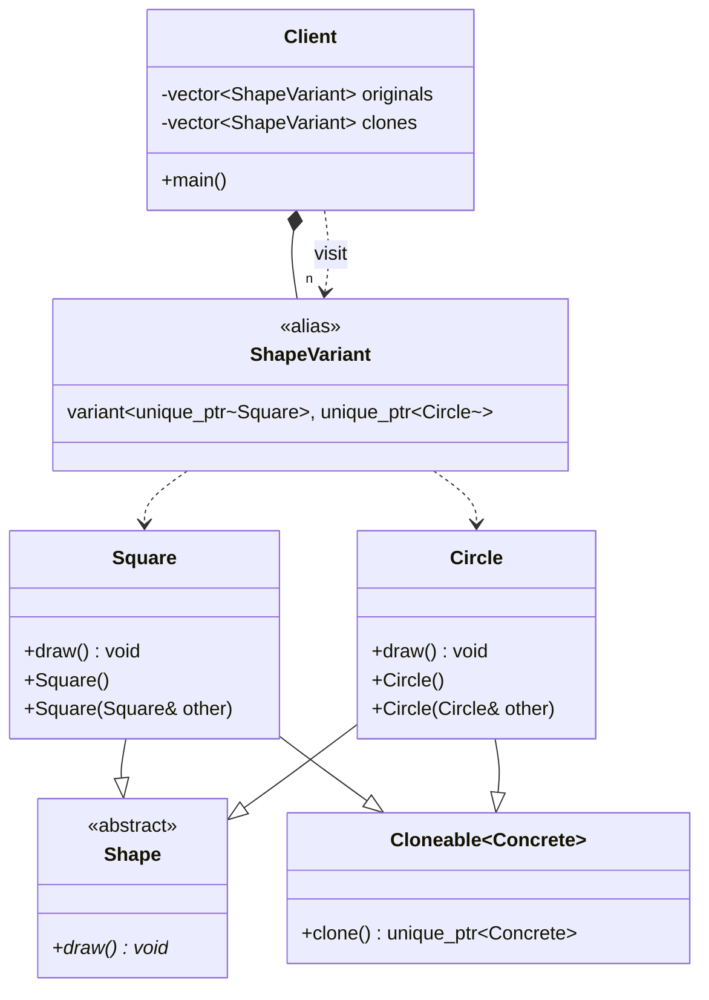

# CRTP & std::variant - Variant Heap Clone

### Design Note:
This diagram illustrates a **Hybrid Modern Design** for the Prototype Pattern. 
It combines the type safety of `std::variant` with the performance of CRTP 
Static Polymorphism for heap-allocated objects.

1. **Dual Hierarchy (Multiple Inheritance):** Concrete classes like `Square` 
   satisfy the business interface (`Shape`) and the cloning infrastructure 
   (`Cloneable<T>`) independently.
2. **Non-Virtual Cloning:** The `clone()` method is provided by the CRTP Mixin. 
   There is no `virtual clone()` in the `Shape` base class, adhering to the 
   Zero-Overhead Principle.
3. **Static Dispatch:** Since `std::unique_ptr` is non-copyable, we cannot 
   simply copy the variant. Instead, we use `std::visit` in the Client code. 
   The compiler resolves the correct `clone()` call for each concrete type 
   at compile-time.
4. **Memory Management:** Objects are stored on the heap and managed by 
   `std::unique_ptr`, ensuring that memory is released automatically while 
   allowing for heterogeneous collections via `std::variant`.

**Author:** Mario Galindo Queralt, Ph.D.
