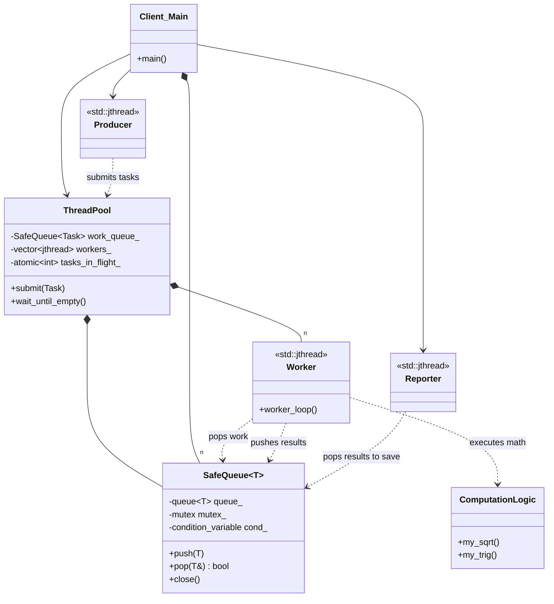

# THREAD POOL / ASYNCHRONOUS PIPELINE (CONCURRENCY)

## Intent
The Thread Pool pattern manages a dedicated set of persistent worker threads to 
execute multiple tasks concurrently. It decouples task submission from 
execution, optimizing system resources by avoiding the overhead of constant 
thread creation and destruction.

## The Problem
In high-performance applications, spawning a new thread for every background 
task is inefficient and dangerous:
1. **Thread Lifecycle Overhead**: Creating and joining threads consumes 
   significant CPU cycles and increases latency.
2. **Resource Exhaustion**: Unlimited thread creation can lead to system 
   instability, memory exhaustion, and CPU "thrashing."
3. **Synchronization Complexity**: Manually coordinating producers and 
   consumers often results in race conditions or deadlocks.

## The Solution: A Task-Agnostic Infrastructure
The core of this pattern is a centralized "Pool" and a "Synchronized Queue":
- **The Sized Queue (Monitor Pattern)**: A thread-safe container with a 
  fixed capacity. It implements **Backpressure**, meaning the producer is 
  blocked if the queue is full, preventing memory overflow.
- **The Workers**: A set of threads that run in a loop, sleeping when the 
  queue is empty and waking up instantly when a new task arrives.
- **Task-Agnosticism**: By using `std::function<void()>`, the pool remains 
  pure infrastructure. It doesn't need to know the business logic (e.g., math, 
  I/O, or networking). It simply executes the "units of work" it receives.

## Our Advanced Example: The Asynchronous Pipeline
This implementation simulates a professional scientific data-processing 
workflow divided into two distinct batches:

1. **Batch 1: Single-Input / Single-Output**:
   Calculates 200 square roots. Results are sent to a dedicated "Reporter" 
   thread that persists the data into a text file.
   
2. **Batch 2: Multi-Input / Multi-Output**:
   Calculates 100 Sines and Cosines from dual inputs. This demonstrates how 
   the same infrastructure can handle complex data structures and 
   distribute results across multiple files.

### Thread Topology:
- **Producer Thread**: Generates mathematical problems independently.
- **Worker Pool (15 threads)**: Persistent threads that handle the heavy 
  computation (encapsulated in pure functions like `my_sqrt` and `my_trig`).
- **Reporter Threads**: Ephemeral (short-lived) threads created per batch 
  to handle specific I/O and persistence logic.

## Technical Highlights
- **std::jthread (C++20)**: Modern "Joining Threads" that provide 
  automatic lifecycle management and safe stopping tokens.
- **Batch Barriers**: A synchronization mechanism (`wait_until_empty`) 
  ensures that the main thread waits for all tasks in a batch to finish 
  before closing the reporter and starting the next phase.
- **Full Traceability**: Workers return the original input data along with 
  the results, a best practice for auditing and data integrity.

## Key Benefits
- **Zero-Overhead Reusability**: The core `ThreadPool.h` is a stable component 
  that never changes, regardless of the complexity of the math tasks.
- **Controlled Concurrency**: Limits parallel execution to match hardware 
  cores, maximizing CPU throughput.
- **Modular Design**: Separates computation logic (pure functions), 
  dispatch logic (lambdas), and reporting logic (specialized threads).

---
# Thread Pool / Asynchronous Pipeline Diagram

### Design Note:
This diagram illustrates the complete asynchronous flow. The 'ThreadPool'
provides the stable execution environment ('Worker Pool'). The 'Client_Main'
orchestrates the lifecycle by creating 'Producer' threads to feed the pool and
'Reporter' threads to drain the results. The 'SafeQueue' acts as the
synchronized bridge between all participants, ensuring thread-safety and
providing backpressure when limits are reached.
