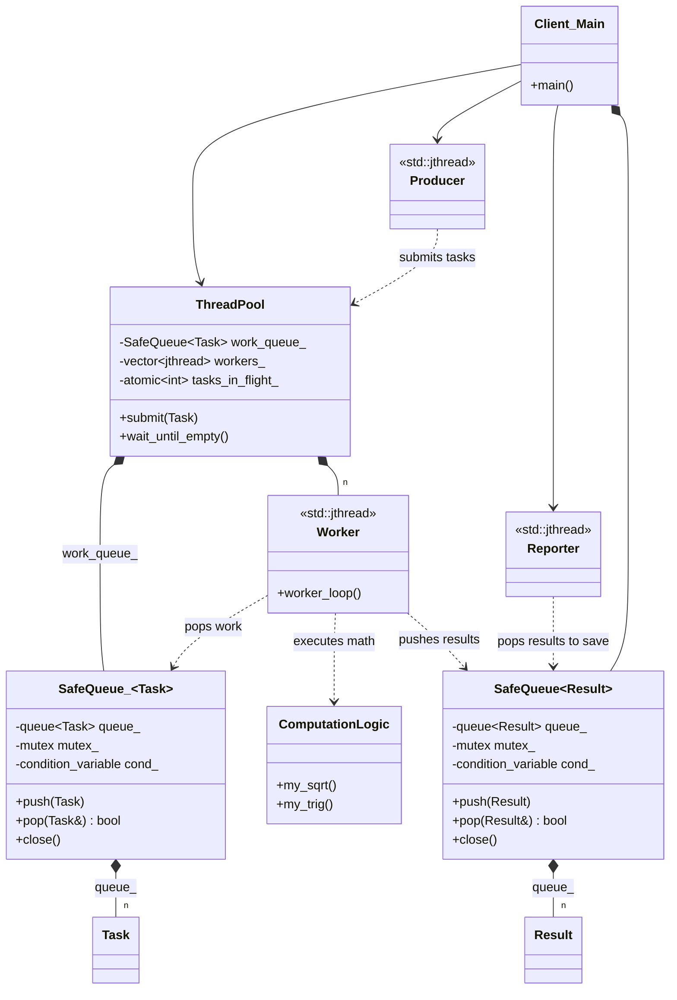

# Thread Pool / Asynchronous Pipeline Diagram

### Design Note:
This diagram illustrates the complete asynchronous flow. The 'ThreadPool'
provides the stable execution environment ('Worker Pool'). The 'Client_Main'
orchestrates the lifecycle by creating 'Producer' threads to feed the pool and
'Reporter' threads to drain the results. The 'SafeQueue' acts as the
synchronized bridge between all participants, ensuring thread-safety and
providing backpressure when limits are reached.
