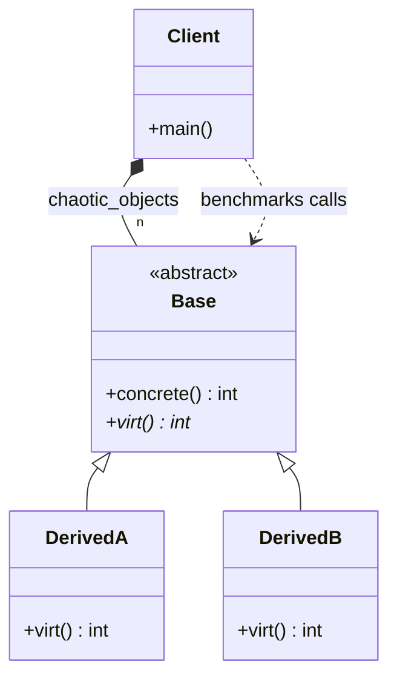

# EXAMPLE 01: POLYMORPHIC BOTTLENECK - HARDWARE ANALYSIS

## Overview
This directory contains a numeric micro-benchmark designed to profile the actual computational
overhead of **Dynamic Dispatch (Virtual Functions)** under different memory organization layouts.

The objective is to measure how CPU hardware components, specifically the **Branch Target Buffer
(BTB)**, interact with inheritance patterns when processing massive sets of objects.

## Workload Parity Verification
To ensure a completely honest hardware profiling setup and eliminate compiler optimization
biases, both tests inside `Polymorphic_bottleneck.cpp` execute the exact same computational
workload (1,000,000,000 total operations):

1. **TEST 1 (Predictable Memory Access)**: 
   Iterates over a stable pointer reference. The hardware predictor can easily cache the virtual
   call destination.

2. **TEST 2 (Chaotic Memory Access)**: 
   Iterates through an array of 10,000 **randomly shuffled** heterogeneous objects. This forces
   the hardware predictor into a state of permanent misprediction.

## Benchmark Insights
* **Predictable Access**: Polymorphism is NOT inherently slow. When the data flow is linear, the
      CPU's BTB handles virtual calls with near-zero overhead.
* **Chaotic Access**: When pointers are interleaved randomly, the CPU pipeline flushes on almost
      every iteration. The result is a **Massive performance penalty** (often exceeding 2000%
      degradation).

## Conclusion
Data disorder, not the `virtual` keyword, is what destroys performance. This benchmark provides
the raw empirical justification for shifting towards **Data-Oriented Design (DOD)** and
**Entity-Component-Systems (ECS)**, where data is kept sorted and contiguous.

---
# Polymorphic Bottleneck Analysis Diagram

### Design Note:
This diagram represents the classical Object-Oriented (OOP) structure used in 
the benchmark. The 'Client' (main function) manages a heterogeneous 
collection of 'Base' pointers, interleaved with 'DerivedA' and 'DerivedB' 
instances. This setup is designed to trigger hardware branch mispredictions 
within the CPU's Branch Target Buffer (BTB) when the virtual function 
'virt()' is called on a shuffled vector. Unlike the Data-Oriented approach 
in Example 02, this design prioritizes abstraction over memory locality, 
resulting in the measured performance bottleneck.

**Author:** Mario Galindo Queralt, Ph.D.
