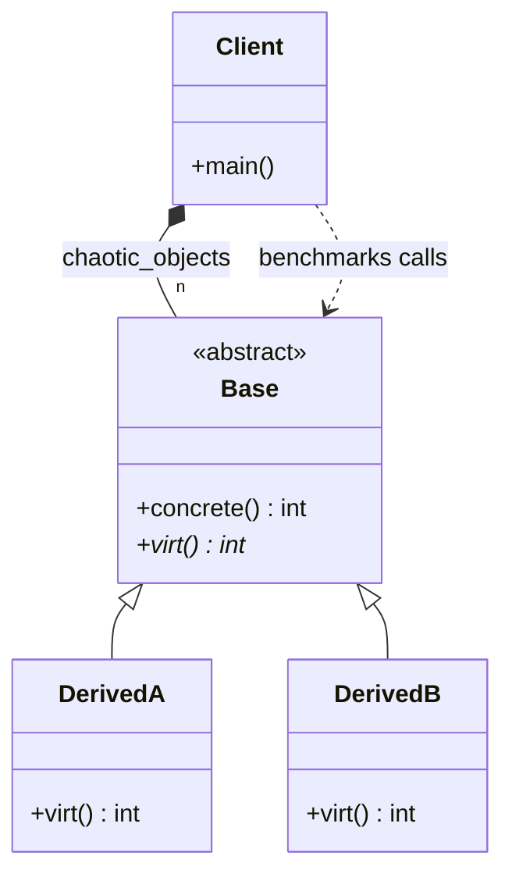

# EXAMPLE 01: POLYMORPHIC BOTTLENECK - HARDWARE ANALYSIS

## Overview
This directory contains a numeric micro-benchmark designed to profile the actual computational
overhead of **Dynamic Dispatch (Virtual Functions)** under different memory organization layouts.

The objective is to measure how CPU hardware components, specifically the **Branch Target Buffer
(BTB)**, interact with inheritance patterns when processing massive sets of objects.

## Workload Parity Verification
To ensure a completely honest hardware profiling setup and eliminate compiler optimization
biases, both tests inside `Polymorphic_bottleneck.cpp` execute the exact same computational
workload (1,000,000,000 total operations):

1. **TEST 1 (Predictable Memory Access):**
   Iterates through a sequentially ordered array of 10,000 homogeneous objects. The hardware
   predictor can easily cache the virtual call destination, isolating the baseline cost of vtable
   indirection. While this contiguous layout mirrors the memory organization used in DOD, a true
   DOD approach goes further by eliminating virtual calls altogether.

2. **TEST 2 (Chaotic Memory Access)**:
   Iterates through an array of 10,000 **randomly shuffled** heterogeneous objects. This forces
   the hardware predictor into a state of permanent misprediction.

## Benchmark Insights
* **Predictable Access:** When the data flow is linear, the CPU's BTB handles virtual calls with
     minimal overhead compared to the chaotic case, although the baseline indirection cost (vtable
     lookup) remains.
* **Chaotic Access:** When pointers are interleaved randomly, the CPU pipeline flushes on almost
      every iteration. The result is a **Massive performance penalty** (often exceeding 1000%
      degradation).

## Conclusion
This architectural analysis demonstrates that what truly destroys performance is
a lot of unordered data, not the use of virtual methods themselves.

If your application data is few or well-ordered and memory access patterns are
predictable, a design utilizing polymorphism is perfect. It remains efficient,
stable, and should not be viewed with distrust. In these scenarios, the
hardware branch predictor and the software abstractions work in perfect harmony.

However, if your specific domain forces a large disordered data layout that cannot
be easily sorted or aligned, you must seriously consider shifting toward
Data-Oriented Design (DOD). It is vital to remember that in software engineering,
there is no "silver bullet." Classical OOP algorithms are remarkably clear,
intuitive to program, and easy to maintain. In contrast, DOD and ECS solutions
can be significantly harder to manage and reason about.

The ultimate guide for choosing between these paradigms must be a deep
understanding of how the computer operates at a hardware level, coupled with
rigorous empirical timing. As Donald Knuth famously stated, "premature
optimization is the root of all evil." We should prioritize clean, maintainable
OOP modeling as the default, and only transition to the complexity of DOD when
actual performance measurements prove that the hardware bottlenecks are
unacceptable for the task at hand.

---
# Polymorphic Bottleneck Analysis Diagram

### Design Note:
This diagram illustrates the classical Object-Oriented (OOP) hierarchy used to 
profile the cost of dynamic dispatch. While this structure represents the 
gold standard for code maintainability and intuitive domain modeling, the 
benchmark reveals its sensitivity to data organization. 

The 'Client' manages a heterogeneous collection of pointers where 'DerivedA' 
and 'DerivedB' instances are interleaved. This specific setup is intended 
to prove that the hardware Branch Target Buffer (BTB) handles polymorphism 
with near-zero overhead when access is predictable, but suffers massive 
mispredictions when the layout is shuffled (chaotic). Ultimately, this 
design is not "slow" by definition, but it prioritizes abstraction over 
memory locality—a trade-off that, as Donald Knuth suggested, should only 
be abandoned for the complexity of DOD when empirical data proves a 
critical bottleneck.

**Author:** Mario Galindo Queralt, Ph.D.
