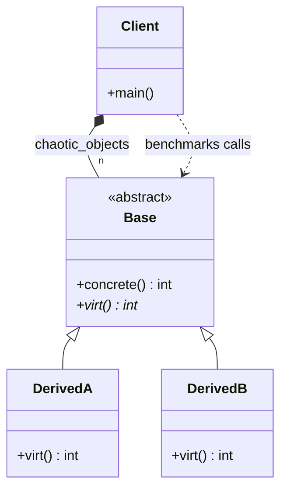

# Polymorphic Bottleneck Analysis Diagram

### Design Note:
This diagram represents the classical Object-Oriented (OOP) structure used in 
the benchmark. The 'Client' (main function) manages a heterogeneous 
collection of 'Base' pointers, interleaved with 'DerivedA' and 'DerivedB' 
instances. This setup is designed to trigger hardware branch mispredictions 
within the CPU's Branch Target Buffer (BTB) when the virtual function 
'virt()' is called on a shuffled vector. Unlike the Data-Oriented approach 
in Example 02, this design prioritizes abstraction over memory locality, 
resulting in the measured performance bottleneck.

**Author:** Mario Galindo Queralt, Ph.D.
