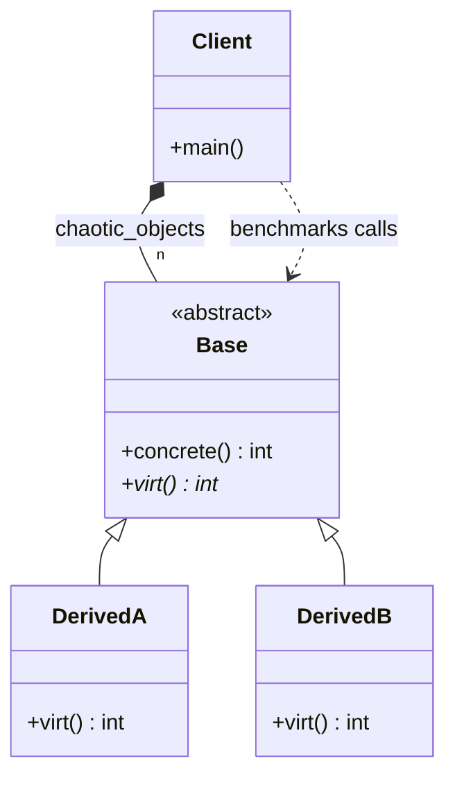

# Polymorphic Bottleneck Analysis Diagram

### Design Note:
This diagram illustrates the classical Object-Oriented (OOP) hierarchy used to 
profile the cost of dynamic dispatch. While this structure represents the 
gold standard for code maintainability and intuitive domain modeling, the 
benchmark reveals its sensitivity to data organization. 

The 'Client' manages a heterogeneous collection of pointers where 'DerivedA' 
and 'DerivedB' instances are interleaved. This specific setup is intended 
to prove that the hardware Branch Target Buffer (BTB) handles polymorphism 
with near-zero overhead when access is predictable, but suffers massive 
mispredictions when the layout is shuffled (chaotic). Ultimately, this 
design is not "slow" by definition, but it prioritizes abstraction over 
memory locality—a trade-off that, as Donald Knuth suggested, should only 
be abandoned for the complexity of DOD when empirical data proves a 
critical bottleneck.

**Author:** Mario Galindo Queralt, Ph.D.
