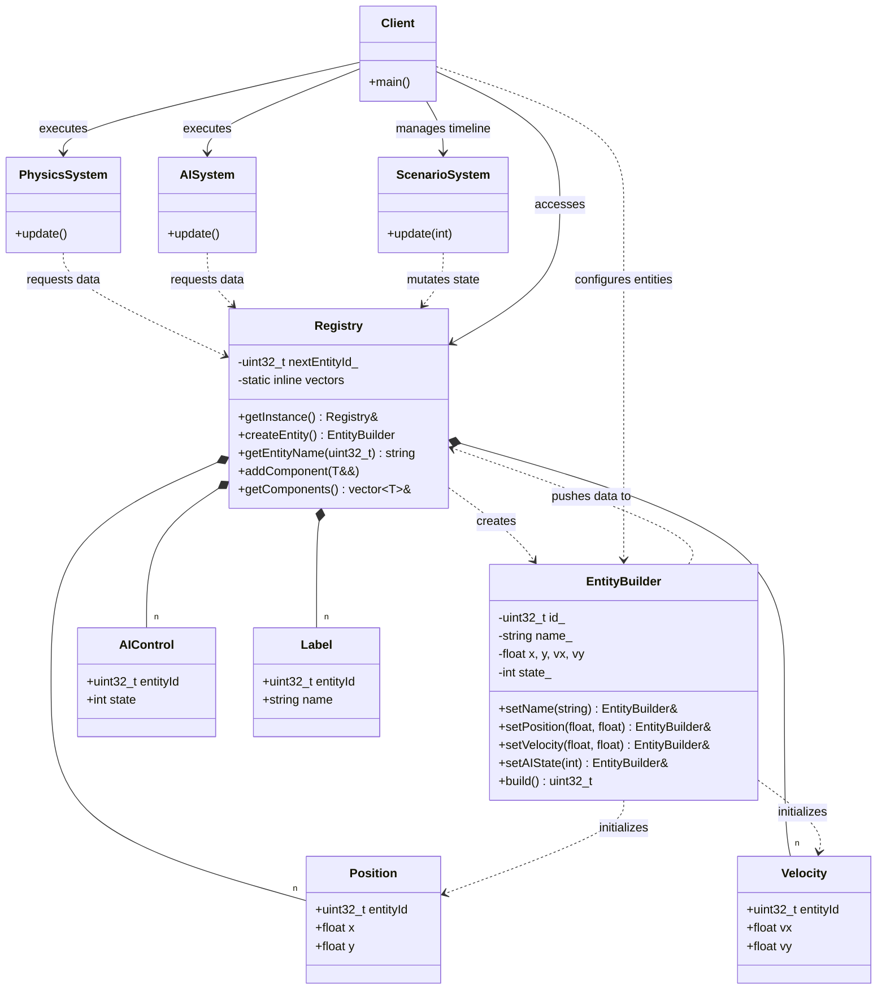

# COMPONENT REGISTRY
## DATA-ORIENTED DESIGN (DOD) + ENTITY-COMPONENT-SYSTEMS (ECS)
**Author:** Mario Galindo Queralt, Ph.D.

## Intent
To manage a massive collection of entities and their behaviors by prioritizing memory layout and
CPU cache efficiency. This pattern, the core of Entity-Component-Systems (ECS), shifts the focus
from "Objects that have data and methods" to "Data buckets processed by specialized Systems".

## The Problem
Traditional Object-Oriented Design (OOD) usually involves a list of 'GameObjects', each
containing a list of pointers to their components. When the system calls 'update()' on every
object, several performance bottlenecks occur:
1. **Memory Fragmentation**: The CPU has to jump to different, non-contiguous memory locations
to find each component.
2. **Cache Pollution**: Unrelated data (like names or AI states) is loaded into the cache during
unrelated calculations (like physics), wasting precious space.
3. **Cache Misses**: These jumps force the CPU to wait for the relatively slow RAM, wasting
thousands of clock cycles per frame.

> **Note**: The actual hardware cost of these bottlenecks is measured and analyzed in [Example
    01: OOP Polymorphic Bottleneck](../01_OOP_Polymorphic_Bottleneck).

## The Solution: Data-Oriented Design (DOD)
DOD reorganizes the application's memory to match the way modern CPUs actually work:
- **Contiguous Storage**: Components of the same type are stored in dedicated "buckets"
    (`std::vector`).
- **Type-to-Storage Mapping**: We use C++ templates to map each unique 'ComponentType' to its
    own static vector. This resolution happens at compile-time (Zero-Overhead).
- **Linear Processing**: Systems (Physics, AI) process these buckets sequentially. When the CPU
    loads one component, it automatically prefetches the next ones, ensuring "Cache Hits" and
    maximum performance.

## Our Example: A Dynamic Tactical Simulation
We simulate a tactical world involving 'Mario', an 'Enemy Guard', and an 'Aggressive Drone' over
a 5-frame timeline:
1. **Registry (Meyers Singleton)**: A central "World Container" that manages unique entity IDs
and static component buckets.
2. **Data Normalization**: We separate heavy metadata ('Label' components) from lean
mathematical data ('Position' and 'Velocity' structs) to maximize cache line utility.
3. **Specialized Systems**: 
   - **PhysicsSystem**: Processes movement only for living entities by iterating through
    contiguous memory.
   - **AISystem**: Handles decision-making and logic reports based on AI states.
   - **ScenarioSystem**: Acts as a "Director", mutating data over time to simulate a live
       environment (e.g., Drone attacks -> Mario defends -> Drone dies).

## Technical Highlights
- **Static Template Buckets**: Utilizes `static inline` storage inside template methods to
    achieve a direct mapping from types to memory without runtime maps or lookups.
- **Type Decaying**: Uses `std::decay_t` to ensure that references and const-qualifiers do not
    create duplicate or incorrect storage buckets.
- **Perfect Forwarding**: Implements `std::forward` to ensure components are added to the world
    with maximum efficiency.
- **Parallel Array Alignment (Sentinel / Null Components)**: Rather than employing 
  complex sparse-set lookup tables for optional components, we enforce strict 
  parallel array alignment. Entities that do not require a certain behavior 
  still receive a default "Null" or "Sentinel" component, preserving O(1) 
  index-based access across all vectors with negligible memory overhead.

## Cross-References
- **Pattern 01 (Builder)**: A Fluent Static Builder is used to guarantee "Parallel Array
    Alignment", ensuring that every entity is simultaneously initialized across all component
    data buckets.
- **Pattern 05 (Singleton)**: The Registry uses a Meyers Singleton to ensure a consistent "World
    State".
- **Pattern 13 (Flyweight)**: The 'Label' component mimics the sharing of identity data to keep
    logic components lightweight.
- **Pattern 15 (Mixin)**: While Mixins compose behavior horizontally via inheritance, ECS
    composes data horizontally via the Registry.
- **Pattern 31 (Variant)**: Contrast. Variant handles heterogeneous types in one container; this
    DOD implementation handles homogeneous types in separate, optimized buckets.

## OO Principles Applied
- **SRP (Single Responsibility)**: Components are pure data; Systems are pure logic.
- **OCP (Open/Closed)**: The Registry is "Open" to new component types via templates without
    modifying its source code.
- **SoC (Separation of Concerns)**: Physics, AI, and Identity are kept in isolated data streams.
- **IoC (Inversion of Control)**: Systems control the flow over the data (Hollywood Principle).
- **KISS (Keep It Simple)**: Avoids complex hierarchies, using simple IDs and POD structs.

---
# Component Registry / Data-Oriented Design Diagram

### Design Note:
This diagram illustrates the complete Data-Oriented Design (DOD) architecture. 
The 'Registry' (Meyers Singleton) acts as the central owner of all component 
vectors. A Fluent 'EntityBuilder' is introduced to guarantee 'Parallel Array 
Alignment': it ensures that every time an entity is created, all corresponding 
data buckets are updated simultaneously, allowing 'Systems' to use a shared 
index 'i' for O(1) cross-component access. This layout maximizes CPU cache 
efficiency by enabling sequential access patterns and eliminating virtual 
function overhead.

**Author:** Mario Galindo Queralt, Ph.D.
