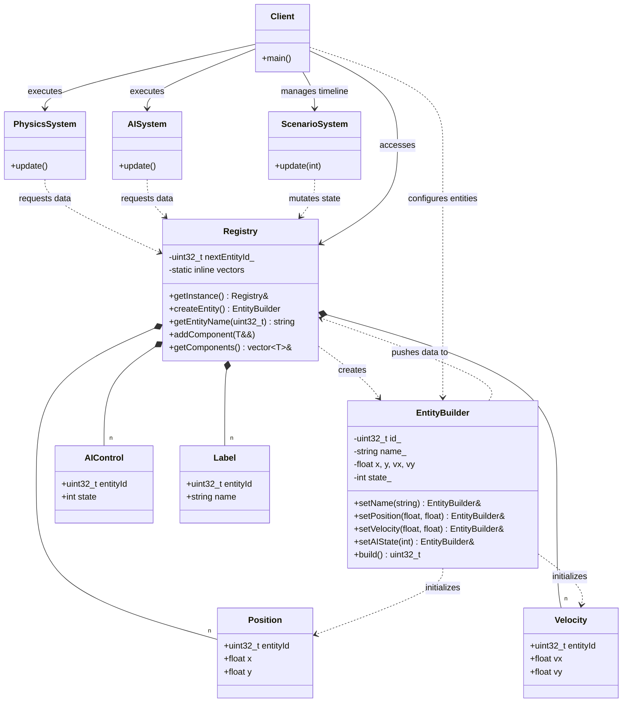

# Component Registry / Data-Oriented Design Diagram

### Design Note:
This diagram illustrates the complete Data-Oriented Design (DOD) architecture. 
The 'Registry' (Meyers Singleton) acts as the central owner of all component 
vectors. A Fluent 'EntityBuilder' is introduced to guarantee 'Parallel Array 
Alignment': it ensures that every time an entity is created, all corresponding 
data buckets are updated simultaneously, allowing 'Systems' to use a shared 
index 'i' for O(1) cross-component access. This layout maximizes CPU cache 
efficiency by enabling sequential access patterns and eliminating virtual 
function overhead.

**Author:** Mario Galindo Queralt, Ph.D.
