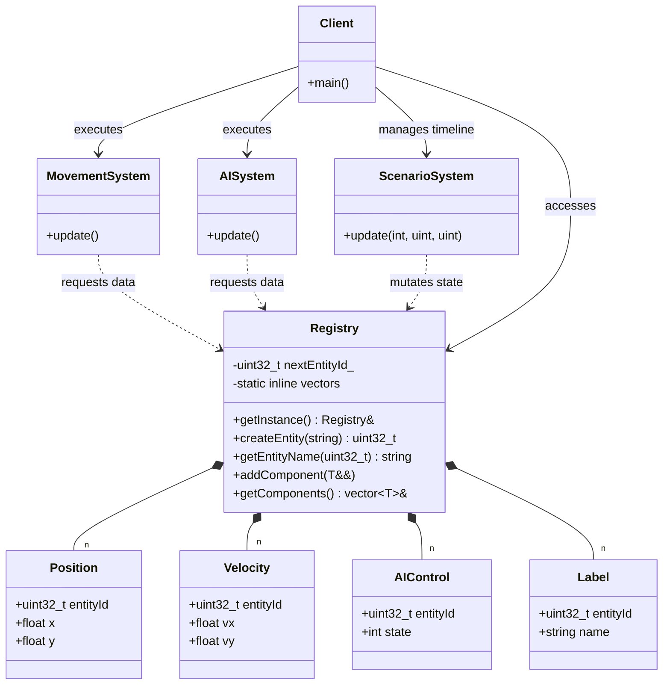

# Component Registry / Data-Oriented Design Diagram

### Design Note:
This diagram illustrates the Data-Oriented Design (DOD) architecture. The 
'Registry' (Meyers Singleton) acts as the central owner of all component 
vectors, ensuring that data of the same type is stored contiguously in 
memory. The 'Systems' are decoupled from each other and from the entities 
themselves; they only interact with the Registry to pull or mutate specific 
data buckets. This layout maximizes CPU cache efficiency by enabling 
sequential access patterns and eliminating virtual function overhead.

**Author:** Mario Galindo Queralt, Ph.D.
