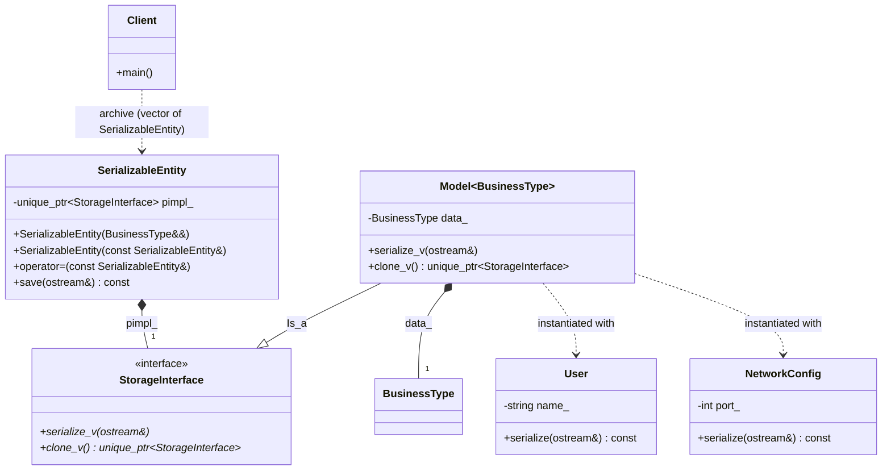

# Type Erasure Pattern (Non-Intrusive Serialization)

### Design Note:
This diagram illustrates the "External Polymorphism" or "Type Erasure" 
architecture. The 'SerializableEntity' acts as a value-based wrapper that 
hides the complex inheritance tree from the client. The 'StorageInterface' and 
'Model' classes are internal details that bridge the gap between 
dynamic polymorphism (virtual functions) and static polymorphism 
(templates). This allows 'User' and 'NetworkConfig' to remain 100% 
independent and non-intrusive, as they do not need to inherit from 
any base class to be stored and processed by the system.

**Author:** Mario Galindo Queralt, Ph.D.
