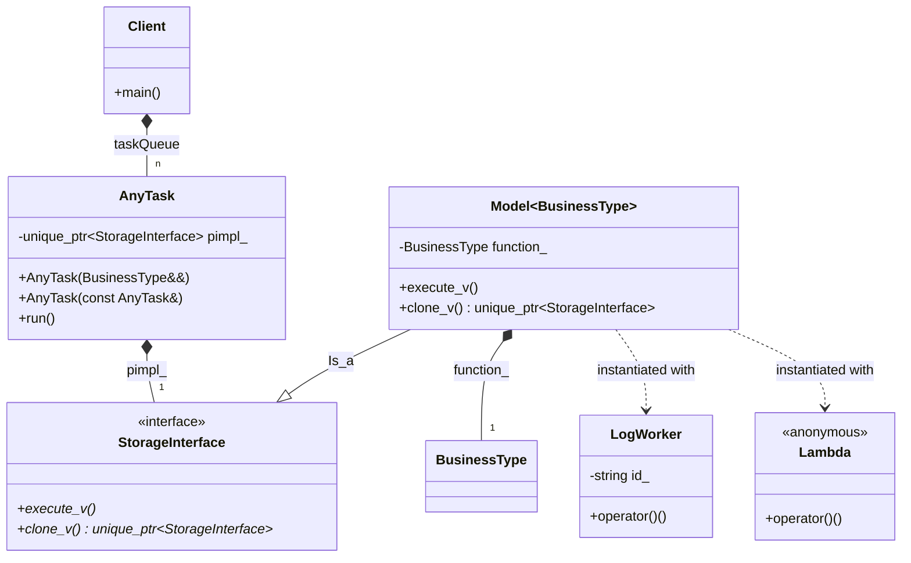

# Type Erasure Pattern (Task Queue)

### Design Note:
This diagram shows the Type Erasure pattern applied to a task execution 
system. The 'AnyTask' class acts as a value-based container that erases 
the specific type of any callable object (like a Lambda or a custom 
functor class). 
1. The 'StorageInterface' provides the virtual polymorphic interface.
2. The 'Model' template bridges the gap by wrapping the specific type.
3. The 'Client' can store these heterogeneous tasks in a single 
   'std::vector<AnyTask>' without using pointers or inheritance, 
   ensuring high cohesion and safe memory management through the 
   'Rule of Seven'.

**Author:** Mario Galindo Queralt, Ph.D.
