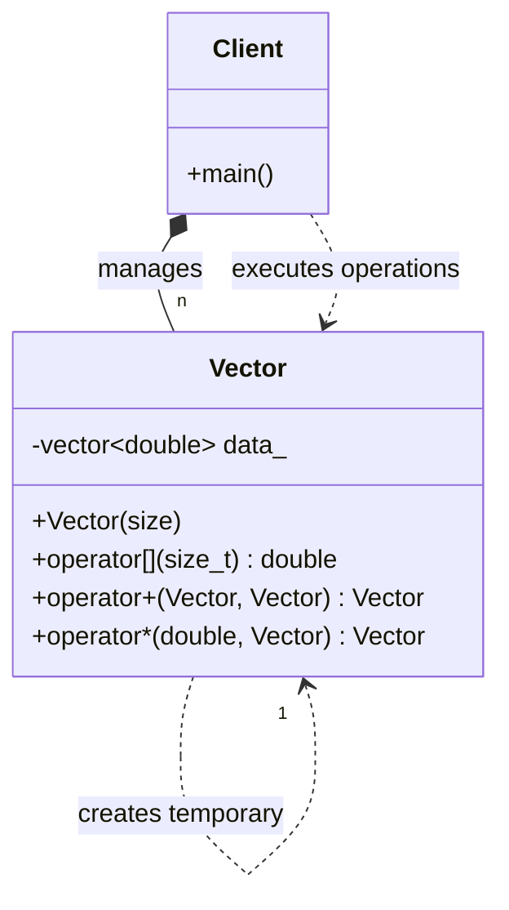

# Expression Templates: Traditional Naive Approach

### Design Note:
This diagram illustrates the traditional operator overloading approach. Each mathematical 
operation (addition or scaling) is a "greedy" function that immediately calculates 
the result and returns a new 'Vector' instance. This leads to a chain of temporary 
objects being allocated on the heap, forcing the CPU to perform multiple passes 
over the memory.

**Author:** Mario Galindo Queralt, Ph.D.
