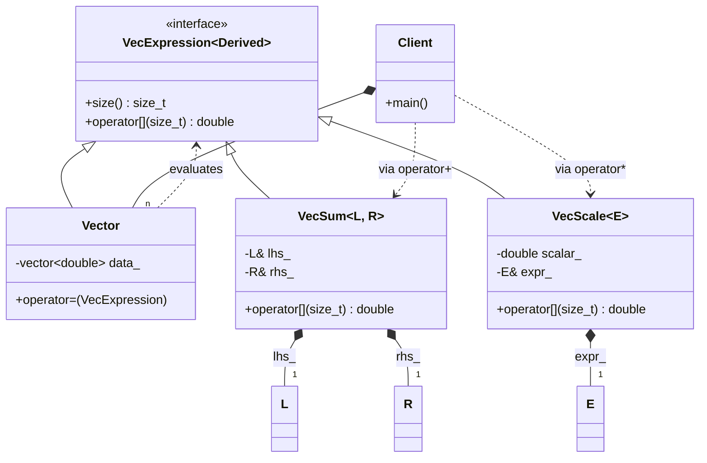

# Expression Templates: CRTP & Static AST

### Design Note:
This diagram shows the classic CRTP-based Expression Template architecture. 
The operators no longer return data; they return 'Proxy Objects' (VecSum, VecScale) 
that form a static Abstract Syntax Tree (AST). All nodes inherit from 'VecExpression', 
allowing the 'Vector' class to accept any complex tree in its assignment operator, 
triggering a single fused loop that eliminates temporary allocations.

**Author:** Mario Galindo Queralt, Ph.D.
