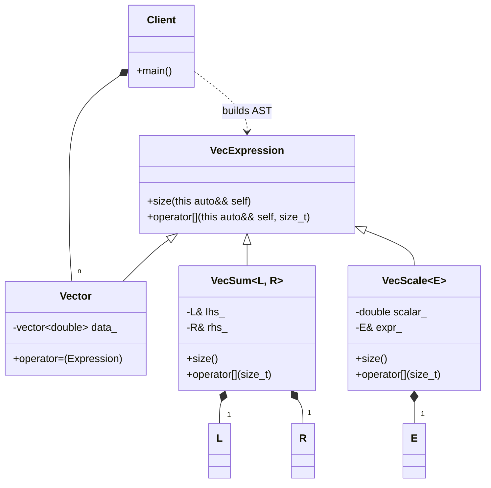

# Expression Templates: Deducing This (C++23)

### Design Note:
This diagram represents the modern C++23 evolution using "Deducing This". 
The 'VecExpression' base class is no longer a template, which simplifies 
the inheritance hierarchy significantly. Using explicit object parameters, 
the base class automatically deduces the concrete node type (Vector, VecSum, 
etc.) at the call site. This provides the same high-performance Loop Fusion 
as the CRTP version but with much cleaner and more maintainable code.

**Author:** Mario Galindo Queralt, Ph.D.
